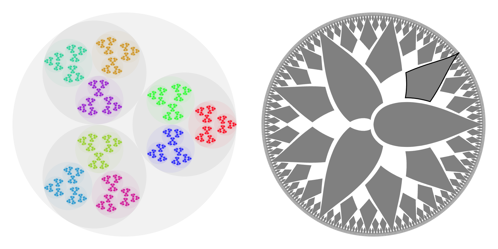
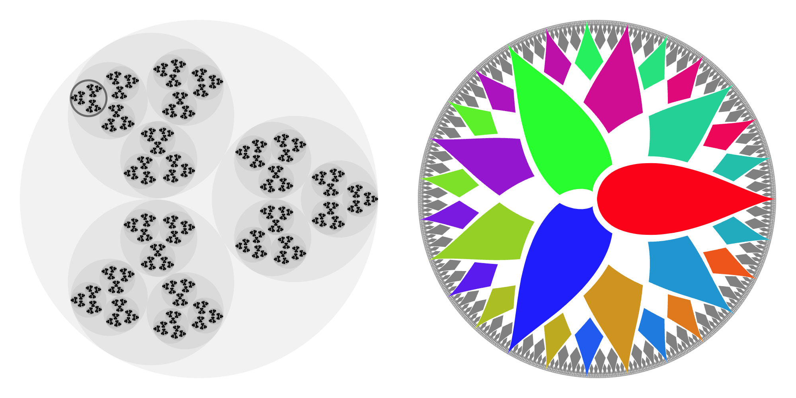

This repo produces SVGs with embedded scripting, which visualize side-by-side:
1. The compact group of [_p_-adic integers](https://en.wikipedia.org/wiki/P-adic_integer)
2. The discrete [Prüfer _p_-group](https://en.wikipedia.org/wiki/Pr%C3%BCfer_group)

## Example output
The following is the output for _p_=3:


As embedded in this README file, that graphic isn't interactive.
**View it with scripting enabled, here:**
https://culter.github.io/AdicViz/Output/p3.svg

When you hover over a group element in one group, the other group will be colored according to the appropriate
Pontryagin dual character. You'll also get a tooltip explaining which group element you're looking at.




(More precisely, in the case of the _p_-adic integers, since each group element occupies zero area,
one actually highlights an element of a _finite projection_ of the group,
which turns into a coloring of a _finite subset_ of the Prüfer group.
That's why, in the second screenshot, the outer elements of the Prüfer group remain gray.)

Here are all of the pre-compiled figures:
* https://culter.github.io/AdicViz/Output/p2.svg
* https://culter.github.io/AdicViz/Output/p3.svg
* https://culter.github.io/AdicViz/Output/p4.svg
* https://culter.github.io/AdicViz/Output/p7.svg

## Mathematical details
The embedding of the _p_-adic integers into the plane is implemented in [Integers.cpp](https://github.com/Culter/AdicViz/blob/main/src/Integers.cpp).
I use the solenoidal embedding,
which is due to [van Dantzig (1930)](https://eudml.org/doc/212336) and appears sporadically in the dynamical systems literature later.
The best modern reference for the geometry is [Chistyakov (1996)](https://link.springer.com/article/10.1007/BF02073866).

The embedding of the Prüfer _p_-group into the plane is implemented in [Fractions.cpp](https://github.com/Culter/AdicViz/blob/main/src/Fractions.cpp).
The exact shapes used are novel; I didn't get them from a reference.
Since the _p_-adic integers are a compact group, their dual is specifically the Prüfer _p_-group with the discrete topology!
In order to contrast the discrete topology with the subset topology inherited from the circle, we do not visualize the group merely as points on a circle.
Rather, each group element occupies a positive-area shape inside the unit disk, and to emphasize the discrete topology, we intentionally leave gaps between elements.
Group elements with smaller denominators are larger.
Geometrically, each shape is something like a wedge landing on the unit circle, with an appropriate radial distortion to ensure that several subgroups of the group are visible.

## Building
This project uses [Bazel](https://bazel.build/) as its build system.

```bash
bazel run //src:adicviz
```

## See also
* Images used in Wikipedia:
  * https://commons.wikimedia.org/wiki/File:2-adic_integers_with_dual_colorings.svg
  * https://commons.wikimedia.org/wiki/File:3-adic_integers_with_dual_colorings.svg
  * https://commons.wikimedia.org/wiki/File:2-adic_integers_with_labels.svg
  * https://commons.wikimedia.org/wiki/File:3-adic_integers_with_labels.svg
  * https://commons.wikimedia.org/wiki/File:3-adic_metric_on_Z_mod_27_blue.svg
  * https://commons.wikimedia.org/wiki/File:4adic_333.svg
* Animation of the 3-adic solenoid:
  * Looping 3-adic solenoid https://www.youtube.com/shorts/cJa1gcKEtCQ
  * Half of a 2-adic solenoid loop https://www.youtube.com/shorts/ybKYFWvUkX4
* Also featured in: https://blogs.ams.org/visualinsight/2014/10/01/2-adic-integers/
* Related StackExchange threads:
  * https://math.stackexchange.com/questions/583609/p-adic-numbers-and-group-characters
  * https://math.stackexchange.com/questions/2020194/if-h-subseteq-g-are-finite-abelian-groups-how-does-l2h-embed-into-l2
  * https://math.stackexchange.com/questions/2436717/visualizing-textbfq-p-vs-textbff-pt
* Further resources, not by me:
  * https://en.wikipedia.org/wiki/Solenoid_(mathematics)
